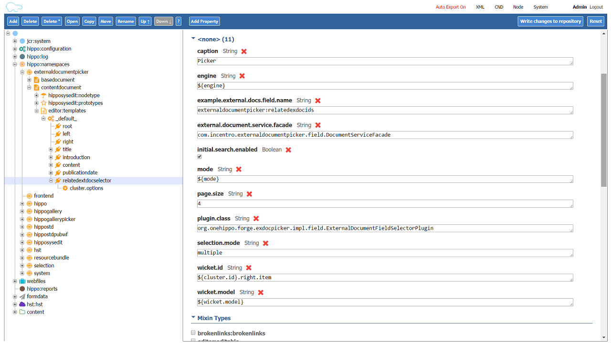

# Hippo External Document Picker Example Implementation
Example implementation, using the Hippo Forge plugin "External Document Picker" to retrieve external documents from a JSON REST endpoint

## How to implement
1. Add the neccesary dependencies to pom [[1]](#1)
2. Implement your DocumentServiceFacede from which the picker will recieve it's documents [[2]](cms/src/main/java/com/incentro/externaldocumentpicker/field/DocumentServiceFacade.java)
3. Point it to your JSON endpoint by editing the public static final String constant JSON_REST_URL
4. Add the field to your document type [[3]](#3)
5. Rebuild and restart

## Find additional documentation for the plugin itself here:
The official documentation of the Hippo Forge plugin.
https://onehippo-forge.github.io/external-document-picker/


### <a name="1"></a> Dependencies
#### main pom.xml:
```xml
<?xml version="1.0" encoding="UTF-8"?>
<project>
    <properties>
        <forge.exdocpickerbase.version>3.1.1</forge.exdocpickerbase.version>
    </properties>
    <dependencyManagement>
        <dependencies>
          <!--External document picker dependency-->
          <dependency>
            <groupId>org.onehippo.forge.exdocpickerbase</groupId>
            <artifactId>exdocpickerbase-field</artifactId>
            <version>${forge.exdocpickerbase.version}</version>
          </dependency>
          
          <!-- Json support -->
           <dependency>
            <groupId>net.sf.json-lib</groupId>
            <artifactId>json-lib</artifactId>
            <version>${json-lib.version}</version>
            <classifier>jdk15</classifier>
          </dependency>
          
          <!-- Spring Framework -->
          <dependency>
            <groupId>org.springframework</groupId>
            <artifactId>spring-aop</artifactId>
            <version>${spring.version}</version>
          </dependency>
          <dependency>
            <groupId>org.springframework</groupId>
            <artifactId>spring-beans</artifactId>
            <version>${spring.version}</version>
          </dependency>
          <dependency>
            <groupId>org.springframework</groupId>
            <artifactId>spring-core</artifactId>
            <version>${spring.version}</version>
          </dependency>
          <dependency>
            <groupId>org.springframework</groupId>
            <artifactId>spring-context</artifactId>
            <version>${spring.version}</version>
          </dependency>
          <dependency>
             <groupId>org.springframework</groupId>
            <artifactId>spring-context-support</artifactId>
            <version>${spring.version}</version>
          </dependency>
          <dependency>
            <groupId>org.springframework</groupId>
            <artifactId>spring-expression</artifactId>
            <version>${spring.version}</version>
          </dependency>
          <dependency>
            <groupId>org.springframework</groupId>
            <artifactId>spring-web</artifactId>
             <version>${spring.version}</version>
          </dependency>
          <dependency>
            <groupId>org.springframework</groupId>
            <artifactId>spring-tx</artifactId>
            <version>${spring.version}</version>
          </dependency>
          <dependency>
            <groupId>org.springframework</groupId>
            <artifactId>spring-test</artifactId>
            <version>${spring.version}</version>
            <scope>test</scope>
          </dependency>
        </dependencies>
    </dependencyManagement>
</project>
```
#### cms pom.xml:
```xml
<?xml version="1.0" encoding="UTF-8"?>
<project>
  <depedencies>
    <!--External document picker dependency-->
    <dependency>
        <groupId>org.onehippo.forge.exdocpickerbase</groupId>
        <artifactId>exdocpickerbase-field</artifactId>
    </dependency>
    <dependency>
        <groupId>net.sf.json-lib</groupId>
        <artifactId>json-lib</artifactId>
        <classifier>jdk15</classifier>
    </dependency>
    <dependency>
        <groupId>org.springframework</groupId>
        <artifactId>spring-web</artifactId>
    </dependency>
  </depedencies>
</project>
```

### <a name="3"></a> Add the field to your document type

or import this xml:
```xml
<?xml version="1.0" encoding="UTF-8"?>
<sv:node sv:name="relatedextdocselector" xmlns:sv="http://www.jcp.org/jcr/sv/1.0">
  <sv:property sv:name="jcr:primaryType" sv:type="Name">
    <sv:value>frontend:plugin</sv:value>
  </sv:property>
  <sv:property sv:name="caption" sv:type="String">
    <sv:value>Picker</sv:value>
  </sv:property>
  <sv:property sv:name="engine" sv:type="String">
    <sv:value>${engine}</sv:value>
  </sv:property>
  <sv:property sv:name="example.external.docs.field.name" sv:type="String">
    <sv:value>externaldocumentpicker:relatedexdocids</sv:value>
  </sv:property>
  <sv:property sv:name="external.document.service.facade" sv:type="String">
    <sv:value>com.incentro.externaldocumentpicker.field.DocumentServiceFacade</sv:value>
  </sv:property>
  <sv:property sv:name="initial.search.enabled" sv:type="Boolean">
    <sv:value>true</sv:value>
  </sv:property>
  <sv:property sv:name="mode" sv:type="String">
    <sv:value>${mode}</sv:value>
  </sv:property>
  <sv:property sv:name="page.size" sv:type="String">
    <sv:value>4</sv:value>
  </sv:property>
  <sv:property sv:name="plugin.class" sv:type="String">
    <sv:value>org.onehippo.forge.exdocpicker.impl.field.ExternalDocumentFieldSelectorPlugin</sv:value>
  </sv:property>
  <sv:property sv:name="selection.mode" sv:type="String">
    <sv:value>multiple</sv:value>
  </sv:property>
  <sv:property sv:name="wicket.id" sv:type="String">
    <sv:value>${cluster.id}.right.item</sv:value>
  </sv:property>
  <sv:property sv:name="wicket.model" sv:type="String">
    <sv:value>${wicket.model}</sv:value>
  </sv:property>
  <sv:node sv:name="cluster.options">
    <sv:property sv:name="jcr:primaryType" sv:type="Name">
      <sv:value>frontend:pluginconfig</sv:value>
    </sv:property>
  </sv:node>
</sv:node>
```